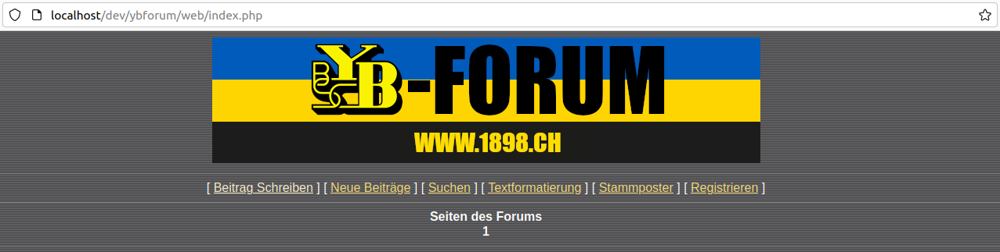

# YB Forum 1898

A forum with a user-interface stuck in the 90s, but with an implementation from the 21 century.

This page provides some information on how to setup your own ybforum.

## Requirements
- PHP 8.2
- MariaDB or MySQL

## Install
1. Follow the instructions in [database](database) to setup the required database.
2. Copy the content of [src](src) to the httpdoc-folder of your webserver.
3. Adjust the database-connection parameters in file [src/model/DbConfig.php](src/model/DbConfig.php).
4. Adjust the settings in file [src/YbForumConfig.php](src/YbForumConfig.php). Most defaults are okay, but update the values for:
   - `BASE_URL`
   - `MAIL_FROM`
   - `MAIL_ALL_BCC`
5. Adjust the values for the google captcha-verify in file [src/helpers/CaptchaV3Config.php](src/helpers/CaptchaV3Config.php), if you want to enable captcha.
   - `CAPTCHA_VERIFY`
   - `CAPTCHA_SITE_KEY`
   - `CAPTCHA_SECRET`

Thats it, now point your browser to the URL serving the content of httpdoc. You should see the index-page with zero posts for now:

You are ready to post your first entry now.

## Notes
### sendmail
Confirmation mails are sent using phps built-in function [mail](https://www.php.net/manual/de/function.mail.php). Make sure that the `sendmail_path` in `php.ini` is configured with a MTA satisfying the [requirements](https://www.php.net/manual/en/mail.requirements.php).
